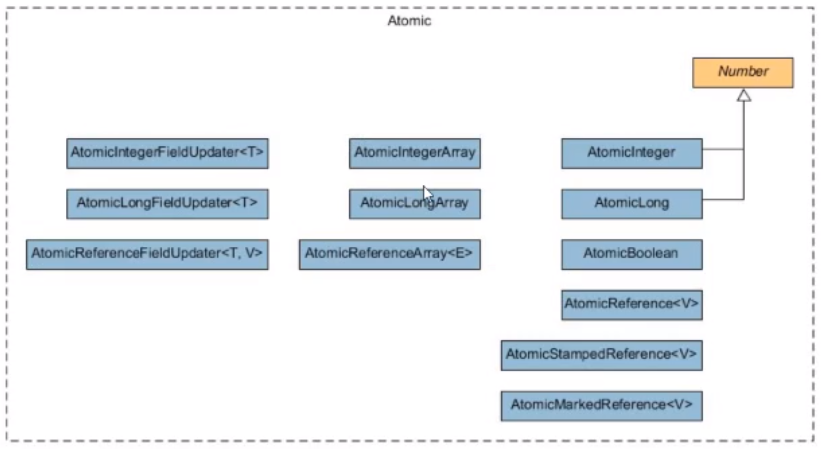

.. include:: ../../defs.rst

CAS
********************************

https://en.wikipedia.org/wiki/Compare-and-swap

lock-free 
    Могут присутствовать потоки, которые по CAS операциям всегда проигрывают (естественно без локов на другие потоки)

wait-free 
    Каждый из потоков должен быть завершен за конечное число шагов (естественно без локов на другие потоки)

.. todo:: Описание что такое CAS. VarHandle

Atomics
------------------

ABA-problem
-------------

.. note::
    То что решается с помощью AtomicMarkableReference и AtomicStampedReference