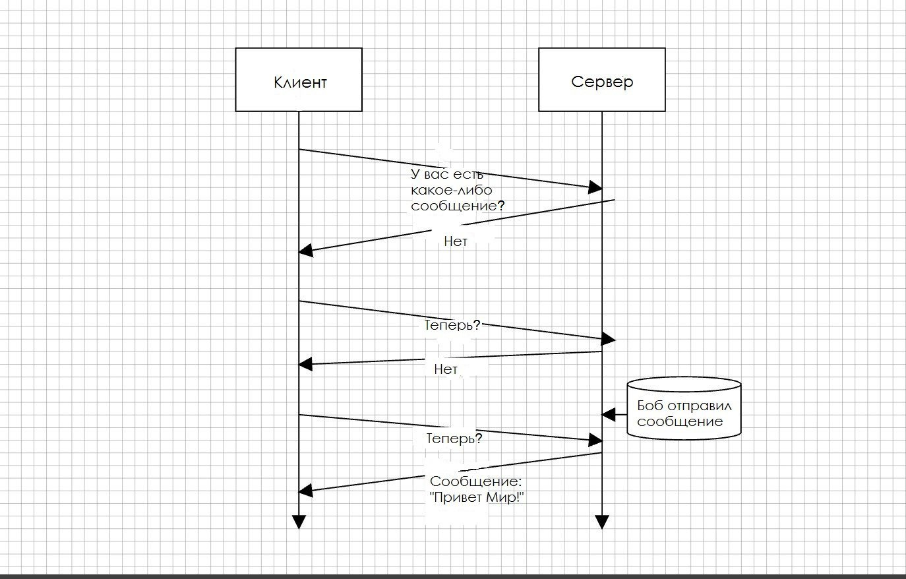
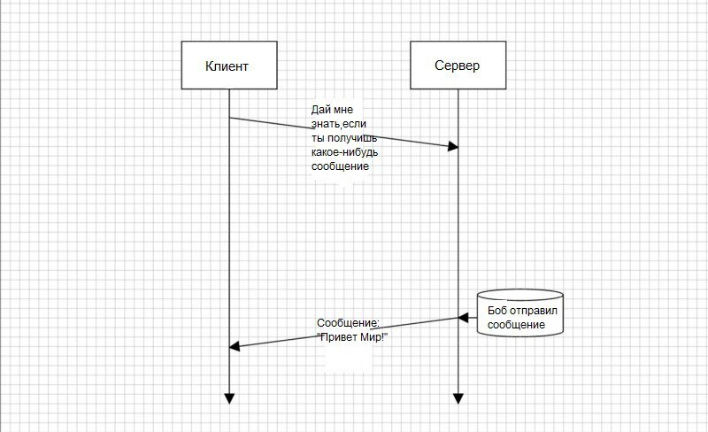

.. include:: ../../defs.rst

WebSocket
************
WebSocket предоставляет альтернативу ограничению эффективной связи между сервером и веб-браузером, обеспечивая двунаправленную полнодуплексную связь клиент-сервер в реальном времени. 
Сервер может отправлять данные клиенту в любое время. Поскольку он работает по протоколу TCP, он также обеспечивает низкоуровневую низкоуровневую связь и снижает издержки каждого сообщения .

Традиционная модель НТТР была обременительной практически для любого приложения, выходящего за пределы простой модели данных "**получить и отправить контент**". 
Представьте себе клиент приложения для интерактивной переписки, в ко­тором участники могут отправлять сообщения в любом порядке и сотни участников могут общаться одновременно.

Для подобных целей стандартный подход "**запрос-ответ**" налагает слишком сильные ограничения. Первыми попытками обойти эти ограничения стали AJAX и Comet. 
Оба были основаны на так называемых длинных опросах: открытии НТТР-соединения и поддержании его в активном состоянии (сохранении соединения открытым) посредством незавершения отправки ответа.

    Схема обмена сообщениями по HTTP

    Схема обмена сообщениями при использовании веб-сокетов

|br|

Java API
========

Сервер : все в пакете ``javax.websocket.server`` |br|
Клиент + API на стороне клиента, а также общие библиотеки для сервера и клиента : содержимое пакета ``javax.websocket``

Существует два способа настройки конечных точек:
    _annotation - based
        Использование специальных аннотаций на уровне методов

    extension-based
        Расширение класса ``javax.websocket.Endpoint_``

Конфигурация ``конечный точек`` с помощью аннотаций
---------------------------------------------------

События жизненного цикла **конечной точки** WebSocket обрабатываются следующими аннотациями:
    ``@ServerEndpoint``
        Контейнер обеспечивает доступность класса как сервера WebSocket, слушающего конкретное пространство URI.

    ``@ClientEndpoint``
        Класс, украшенный этой аннотацией, обрабатывается как клиент WebSocket.

    ``@OnOpen``
        Метод Java с ``@OnOpen`` вызывается контейнером когда новое соединение WebSocket инициируется.

    ``@OnMessage``
        Метод Java, аннотированный ``@OnMessage``, получает информацию из контейнера WebSocket, когда сообщение отправляется в **конечную точку**.

        https://docs.oracle.com/javaee/7/api/javax/websocket/OnMessage.html

    ``@OnError``
        Метод с ``@OnError`` вызывается при наличии проблем со связью.

    ``@OnClose``
        Используется для оформления метода Java, вызываемого, когда соединение WebSocket закрывается.

.. code-block:: java

    @ServerEndpoint(value="/chat/{username}") // URI, где развернута конечная точка. URI определяется относительно корня контейнера сервера и должен начинаться с косой черты.
    public class ChatEndpoint {

        private Session session;
        private static Set<ChatEndpoint> chatEndpoints
          = new CopyOnWriteArraySet<>();
        private static HashMap<String, String> users = new HashMap<>();

        // Когда новый пользователь входит в систему (@OnOpen), он немедленно сопоставляется со структурой данных активных пользователей. 
        // Затем сообщение создается и отправляется на все конечные точки с помощью метода broadcast (см ниже).
        @OnOpen
        public void onOpen(
          Session session,
          @PathParam("username") String username) throws IOException {

            this.session = session;
            chatEndpoints.add(this);
            users.put(session.getId(), username);

            Message message = new Message();
            message.setFrom(username);
            message.setContent("Connected!");
            broadcast(message);
        }

        // Этот метод также используется всякий раз, когда новое сообщение отправляется (@OnMessage) любым из подключенных пользователей - это основная цель чата.
        @OnMessage
        public void onMessage(Session session, Message message)
          throws IOException {

            message.setFrom(users.get(session.getId()));
            broadcast(message);
        }

        // Наконец, когда пользователь больше не подключен к чату, метод @ OnClose очищает конечную точку и передает всем пользователям, что пользователь был отключен.
        @OnClose
        public void onClose(Session session) throws IOException {

            chatEndpoints.remove(this);
            Message message = new Message();
            message.setFrom(users.get(session.getId()));
            message.setContent("Disconnected!");
            broadcast(message);
        }

        // Если в какой-то момент происходит ошибка, метод с аннотацией @OnError обрабатывает ее. 
        // Вы можете использовать этот метод для регистрации информации об ошибке и очистки конечных точек.
        @OnError
        public void onError(Session session, Throwable throwable) {
           //Do error handling here
        }

        private static void broadcast(Message message)
          throws IOException, EncodeException {

            chatEndpoints.forEach(endpoint -> {
                synchronized (endpoint) {
                    try {
                        endpoint.session.getBasicRemote().
                          sendObject(message);
                    } catch (IOException | EncodeException e) {
                        e.printStackTrace();
                    }
                }
            });
        }
    }

Типы сообщений
--------------
Спецификация WebSocket поддерживает два формата данных на проводе - текстовый и двоичный (``java.nio.ByteBuffer`` или ``byte[]​​``).

Прикладной программист может добавить свои специфические типы данных с помощью ``Encoder`` и ``Decoder``

.. code-block:: java

    @ServerEndpoint(
      value="/chat/{username}",
      decoders = MessageDecoder.class,
      encoders = MessageEncoder.class )

Links
======

https://tproger.ru/translations/what-are-web-sockets/

https://www.codeflow.site/ru/article/java-websockets

https://pro-java.ru/java-dlya-nachinayushhix/chto-takoe-veb-sokety-java/